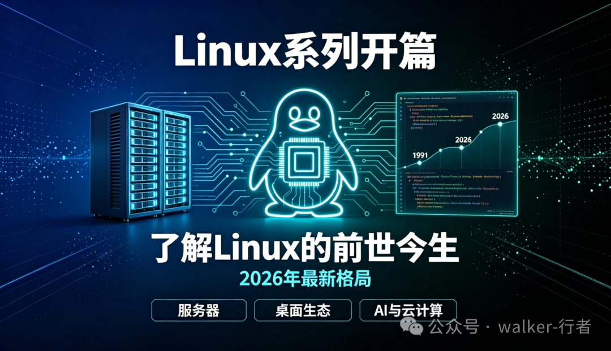

> 原文转载自微信公众号「walker-行者」Linux 系列。
> 原始链接：https://mp.weixin.qq.com/s?__biz=MzkwMDgyMTA2OQ==&mid=2247483750&idx=1&sn=070d216896c416a3711a74a270071d8a&chksm=c0bf7844f7c8f152c02f4ecc4cc1c786819de1d50efdf7165d65d86aa2403e35bd091ff91b7b&cur_album_id=4586547322464501762&scene=190#rd

## Linux系列开篇，带你快速了解Linux的前世今生和2026年的最新格局

## 一、Linux到底用在哪里？

很多人以为Linux只是服务器上的“黑屏命令行”，但它的应用范围远超你的想象。在2026年，Linux的势力版图比任何时候都要广阔。

### 1\. 个人桌面领域

过去Linux桌面是它的薄弱环节，但2026年情况正在发生剧变。全球桌面操作系统中Linux已占据约**2.99%～4.7%**的市场份额。

更值得关注的是，随着微软持续向Windows用户强推AI功能、推行月度订阅模式，大量Windows用户(实则也不多)开始“叛逃”到Linux。2026年初，原本不算主流的Linux发行版**Zorin OS 18（windows转linux推荐这一个，很强烈的windows风格）**，上线不到三个月下载量突破200万，其中超过75%来自Windows用户。

  

**Zorin OS 18 （图片来源官网）**

  

桌面环境方面，**GNOME已正式告别X11，全面进入Wayland时代**；**KDE Plasma**正在打造自己的Linux发行版，被业内视为2026年最值得期待的桌面事件；而System76打造的**COSMIC桌面环境**也有望成为年度热门。

### 2\. 服务器领域（绝对主场）

这是Linux的**绝对主场**。2024年Linux在全球服务器操作系统市场占有44.8%的份额，**2026年预计将达到51.3%**。全球Linux操作系统市场2026年估值已达**107.3亿美元**，预计2029年将增长到180.7亿美元。

在企业级Linux领域，**Red Hat（红帽）占43.1%、Ubuntu占33.9%、SUSE占11.2%**，三者合计占据超过88%的企业级Linux部署份额。

在**Web服务器领域，Nginx凭借卓越的高并发处理能力全面超越Apache**，成为现代架构的首选。而**全球最快的500台超级计算机，全部运行Linux**，这一纪录自2017年11月以来从未中断。

### 3\. 嵌入式与新兴领域

Linux内核可裁剪（最小几百KB）、网络支持好、成本低的优势，使其在嵌入式领域持续扩张：

-   **智能汽车**：Linux正成为软件定义汽车的默认平台。Elektrobit在CES 2026展示了EB Linux for Safety Applications，支持符合ISO 26262安全标准的汽车系统。
    
-   **物联网与边缘AI**：多家厂商在CES 2026将Linux确立为**可扩展边缘AI和工业物联网的默认平台**。Ubuntu Core已成为工业物联网设备的长期支持层。
    
-   **智能电视**：LG的webOS和三星的Tizen OS都是基于Linux的操作系统。
    
-   **AI与云计算**：2025至2026年，Red Hat OpenShift上运行的虚拟机数量实现了**417%的大幅增长**。Ubuntu 26.04 LTS更是被定位为“为智能体时代打造的AI操作系统”。
    

* * *

## 二、Linux是什么？它和Unix什么关系？

### Linux概述

-   Linux是一个**开源、免费**的操作系统。
    
-   它的**稳定性、安全性、高并发处理能力**得到了业界公认。
    
-   常见的操作系统有Windows、macOS、Linux、Unix、Android、iOS等，Linux是其中重要的一员。
    

### Linux和Unix的渊源

**Unix怎么来的？**  
Unix诞生于上世纪60年代末的贝尔实验室，是一个强大的多用户、多任务操作系统，但最初是收费且闭源的。

**Linux怎么来的？**  
1991年，芬兰大学生**林纳斯·托瓦兹（Linus Torvalds）** 为了学习操作系统，自己写了一个类Unix的内核，并把它开源了。这就是Linux的雏形（0.01版只有不到1万行代码）。后来在全球开发者的贡献下，Linux成长为一个功能完整的操作系统。

值得一提的是，Linus也是**Git**的创作者。

**2026年Linux内核的新里程碑**：2026年4月13日，**Linux 7.0内核正式发布**。虽然版本号从6.19跃升至7.0主要是命名惯例（次版本号达到X.19后提升主版本号），但更新内容依然充实——新增对Intel Nova Lake处理器、ARM64原子指令及国产龙芯LoongArch架构的支持。更重要的是，**Rust语言在内核中的支持已正式脱离实验状态**，Debian已决定其核心APT包管理器将用Rust开发——这意味着Linux在内存安全方面迈出了历史性的一步。

* * *

## 三、2026年Linux的主要发行版

Linux只是一个内核，我们平常说的“安装Linux”其实是指安装它的**发行版**。2026年的格局与几年前已有很大不同：

| 
发行版

 | 

特点

 | 

2026年动态

 |
| --- | --- | --- |
| **Ubuntu** | 

最适合新手，AI/云原生生态强大

 | 

Ubuntu 26.04 LTS已发布，深度优化GPU支持和AI工具链

 |
| **Red Hat（RHEL）** | 

企业级商业版，市场份额约34.2%

 | 

RHEL 10推出镜像化交付模式

 |
| **CentOS** | 

⚠️ **已全面停更**

 | 

CentOS 7已于2024年6月EOL，**不再推荐用于生产环境**

 |
| **Rocky Linux / AlmaLinux** | 

CentOS的替代方案

 | 

免费二进制兼容RHEL，合计占2-4%份额

 |
| **银河麒麟 / 统信UOS** | 

国产Linux发行版

 | 

党政办公市场占有率领先，金融核心系统占比超60%

 |
| **CachyOS** | 

2026年最热门的桌面发行版

 | 

基于Arch，已占据DistroWatch榜首超18个月

 |
| **Linux Mint** | 

最稳定的桌面选择

 | 

2026年1月发布22.3版本

 |
| **Azure Linux** | 

微软自有Linux发行版

 | 

Build 2026大会发布4.0版本

 |

> ⚠️ **特别提醒**：在2026年，**CentOS 7已于2024年6月30日停止维护（EOL）**，不再收到安全更新。如果你现在学习Linux，建议改用**Rocky Linux、AlmaLinux**（CentOS的最佳替代）或**Ubuntu LTS**作为学习环境。

* * *

## 四、2026年学习Linux的新趋势

2026年有一些新动向值得关注：

1.  **“一切皆文件”** ——Linux的核心哲学从未改变。
    
2.  **容器化与不可变系统**——**不可变Linux发行版**（如Fedora Silverblue、Ubuntu Core）正在获得企业青睐，只读系统镜像、原子更新显著简化了回滚并减少了“依赖地狱”。
    
3.  **AI辅助运维**——企业级Linux开始引入**生成式AI辅助运维**，自动分析日志异常、预测潜在风险。
    
4.  **Rust语言**——正在成为Linux内核开发的重要语言，提升系统安全性。
    
5.  **国产操作系统崛起**——在党政、金融、电力等关键基础设施领域，国产Linux发行版（银河麒麟、统信UOS、麒麟信安等）正在规模化部署。
    

### 📚 参考来源

1.  **FossPost** – _Linux Market Share Statistics_  
    https://fosspost.org/linux-market-share-statistics/
    
2.  **6sense** – _Server & Desktop OS Market Share_  
    https://6sense.com/tech/server-and-desktop-os
    
3.  **Phoronix** – _Linux 7.0 Released_  
    https://www.phoronix.com/news/Linux-7.0-Released
    
4.  **中关村在线** – _Linux 7.0内核正式发布_  
    https://ai.zol.com.cn/1164/11647451.html
    
5.  **阿里云** – _CentOS 7停止维护官方公告_  
    https://www.alibabacloud.com/help/zh/ecs/user-guide/options-for-dealing-with-centos-linux-end-of-life
    
6.  **Ubuntu官方** – _Ubuntu 26.04 LTS Release Notes_  
    https://documentation.ubuntu.com/release-notes/26.04/
    
7.  **Ubuntu中文博客** – _Canonical发布Ubuntu 26.04 LTS_  
    https://ubuntu.cn/blog/canonical-releases-ubuntu-26-04-lts-resolute-raccoon\_cn
    
8.  **CloudSoftSol** – _Which Linux Distribution Rules 2026?_  
    https://cloudsoftsol.com/linux/which-linux-distribution-rules-2026/
    
9.  **微信公众号** – \*2026年Linux发行版TOP 10\*  
    [http://mp.weixin.qq.com/s?\_\_biz=MzI4MDQwMzk3OQ==&mid=2247596948&idx=4&sn=b11de4fc961ace8cdee4a4a0bb405e57](http://mp.weixin.qq.com/s?__biz=MzI4MDQwMzk3OQ==&mid=2247596948&idx=4&sn=b11de4fc961ace8cdee4a4a0bb405e57&scene=21#wechat_redirect)
    
10.  **TechPowerUp** – _Linux Desktop Market Share Reaches 3.07%_  
     https://www.techpowerup.com/
     

说明：AI在整理过程中协助了信息汇总
