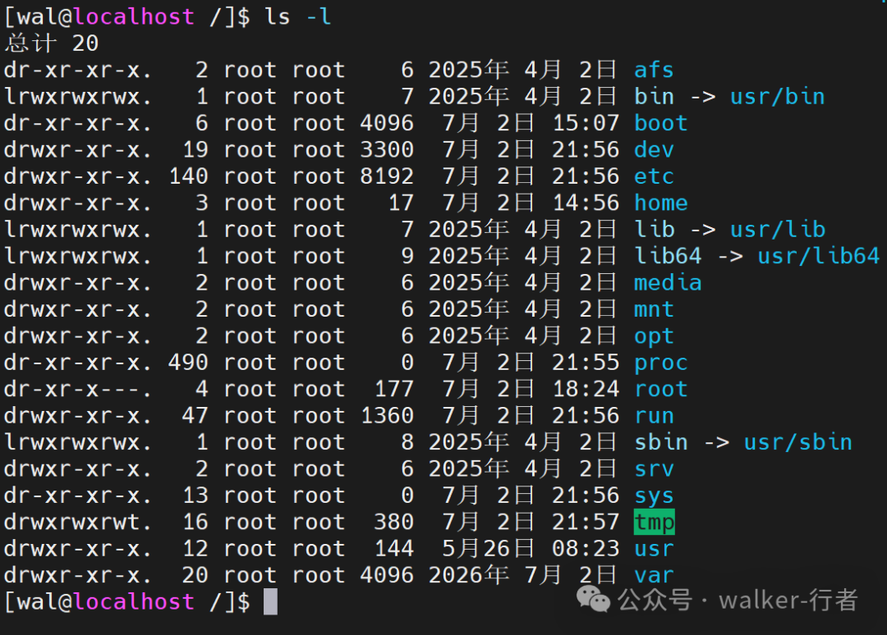

> 原文转载自微信公众号「walker-行者」Linux 系列。
> 原始链接：https://mp.weixin.qq.com/s?__biz=MzkwMDgyMTA2OQ==&mid=2247483786&idx=1&sn=3a38bc100f1766ae263dd2882bba90df&chksm=c0bf78a8f7c8f1beaf93f3250e797cf5903e480730bf62f94073bed35112cf1be1417cbb36a7&cur_album_id=4586547322464501762&scene=189#wechat_redirect

Linux 的目录结构严格遵循 **FHS（文件系统层次结构标准，Filesystem Hierarchy Standard）**，其核心逻辑是**一切从根（/）开始**，采用树形倒置结构。

现代主流发行版普遍进行了 **`/usr` 合并**，将根目录下的 `/bin`、`/sbin`、`/lib` 等通过软链接指向 `/usr` 对应目录。为了便于理解，下面按**功能分区**为你详细拆解：

### 1\. 系统启动与内核（开机必需/非必要不要动）

-   **`/boot`**：存放 Linux 内核文件（vmlinuz）、引导加载程序（GRUB）及初始化镜像（initramfs），**建议单独分区（同时和引导方式有关，损坏无法正常启动）**。
    
-   **`/root`**：超级管理员（root）的家目录，权限极高，普通用户无法访问。（这个可以动）
    
-   **`/sys`**：虚拟文件系统（sysfs），将内核中的设备、总线、驱动等以文件形式呈现，供内核与用户态通信（如修改内核参数），**不占硬盘空间**。
    
-   **`/srv`**：服务数据仓库，存放本机提供的网络服务（如 Web 网站代码、FTP 上传文件）所产生的实际业务数据，占用硬盘空间，默认为空，由管理员按需使用。
    
-   **`/proc`**：虚拟文件系统，存放当前运行进程和系统内核信息的映射（如 `/proc/cpuinfo` 查看 CPU），**不占硬盘空间**。
    
-   **`/lost+found`**：文件系统的“急救失物招领处”，专用于系统意外崩溃或断电重启后，存放被 `fsck` 工具紧急抢救回来的失联文件（按 inode 编号命名），**它不是垃圾箱，严禁随意清理**。
    

* * *

### 2\. 用户命令与基础库（核心软件）

_（注：现代系统下，`/bin`、`/sbin`、`/lib` 通常为软链接指向 `/usr` 下的同名目录）_

-   **`/bin`**：（binary缩写）存放所有用户（包括普通用户）都可执行的**基础系统命令**（如 `ls`、`cp`、`cat`）。
    
-   **`/sbin`**：（super bin）存放**系统管理员专用**的管理命令（如 `fdisk`、`mount`、`reboot`），普通用户通常无法直接执行。
    
-   **`/lib`** 与 **`/lib64`**：存放 `/bin` 和 `/sbin` 中命令所需的**动态链接库**（类似 Windows 的 `.dll`）及内核模块。`/lib64` 专用于 64 位库。
    

* * *

### 3\. 系统配置与运行时（核心数据）

-   **`/etc`**：（常用）**系统配置文件的“心脏”**。几乎所有服务的配置文件都在此（如网卡配置、`passwd` 用户密码、`hostname`、`nginx` 配置等）。**普通用户只读，管理员可写**。
    
-   **`/var`**：存放**经常变化的数据**（Variable data）。重要子目录：
    

-   `/var/log`：系统及服务的**日志文件**（排错必看）。
    
-   `/var/spool`：打印队列、邮件队列（如 `/var/spool/mail`）。
    
-   `/var/cache`：应用程序的缓存数据。
    

-   **`/run`**：系统启动以来的**运行时数据**，存放 PID 文件、Socket 文件等。**重启即清空**（存在于内存中）。
    
-   **`/tmp`**：**临时文件**。任何用户都可读写，系统重启或定期清理。现代系统常挂载为 `tmpfs`（内存文件系统）以提高速度。
    

* * *

### 4\. 用户数据与应用程序（资源存放）

-   **`/home`**：（常用）    **普通用户的家目录**。每个用户拥有子目录（如 `/home/zhangsan`），存放个人文档、下载、代码及用户级配置文件（以 `.` 开头的隐藏文件）。
    
-   **`/usr`**：（常用）**用户系统资源**（Unix System Resources），体积最大的目录。注意它不是“User”，而是类 Unix 系统软件包的存放地（类比Program Files）：
    

-   `/usr/bin` 与 `/usr/sbin`：系统大部分可执行命令的真正住所。
    
-   `/usr/lib`：应用程序共享库。
    
-   `/usr/local`：（常用）**管理员手动编译安装**的软件默认路径（与系统包管理器软件隔离）。
    
-   `/usr/share`：共享数据（如文档、字体、图标、时区信息）。
    
-   `/usr/src`：内核源代码或下载的源码包。
    

-   **`/opt`**：**第三方大型商业软件**的安装目录（如 Oracle JDK、Google Chrome、微信）。习惯上将每个软件放在单独的子目录中（如 `/opt/google`）。
    

* * *

### 5\. 设备与挂载点（硬件接口）

-   **`/dev`**：**设备文件目录**。所有硬件（硬盘、鼠标、键盘、终端）都被抽象为文件（这也是为什么说linux一切皆文件）（类比Windows文件管理器）：
    

-   `/dev/sda` 或 `/dev/nvme0n1`：代表第一块硬盘。
    
-   `/dev/tty` 或 `/dev/pts`：终端设备。
    

-   **`/mnt`**：（常用）**临时挂载点**。系统管理员常在此手动挂载其他文件系统（如 U 盘、ISO 镜像）。
    
-   **`/media`**：（常用）**自动挂载目录**。现代桌面环境插入 U 盘或光盘时，系统默认自动挂载在此（如 `/media/username/USB_DISK`）。
    

  

* * *

快速记忆与查看技巧

1.  **核心记忆**：**/bin** 命令，**/etc** 配，**/var** 日志，**/home** 家，**/dev** 设备，**/proc** 虚拟。
    
2.  **查看命令**：在终端输入 `ls -l /` 查看根目录，或输入 `man hier` 查看官方手册页（最权威的解释）。
    

**特别提醒**：如果你的 Linux 是精简容器（如 Docker 镜像），通常只有 `/bin`、`/etc`、`/var` 等核心目录，没有 `/boot` 或 `/home`，因为容器共享宿主机内核，无需引导程序。

  

