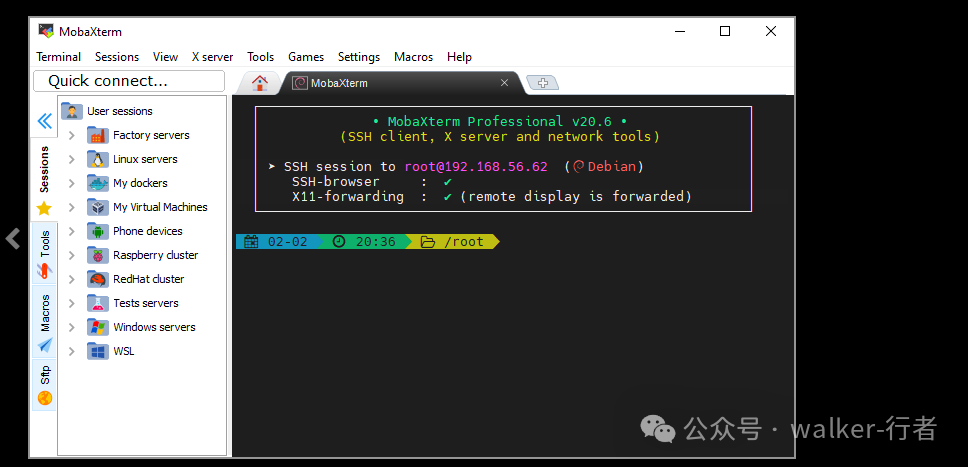

> 原文转载自微信公众号「walker-行者」Linux 系列。
> 原始链接：https://mp.weixin.qq.com/s?__biz=MzkwMDgyMTA2OQ==&mid=2247483800&idx=1&sn=057271f73891320fe87ceaf5c7899d03&chksm=c0bf78baf7c8f1ac9883b46f78fe9d73bb563fdcc3976cbee89503125f262af8f29e229574f6&cur_album_id=4586547322464501762&scene=189#wechat_redirect

## 一、SSH命令

bash

ssh\[options\]\[user@\]hostname \[command\]

SSH（Secure Shell）是Linux远程管理的标准协议，所有操作都从这个命令开始。

**常用选项：**

-   `-p` ：指定端口（默认22）
    
-   `-v` ：调试模式，排错利器
    
-   `-i` ：指定私钥文件（免密登录必备）
    

**举个栗子🌰：**

bash

\# 用root身份连接远程服务器ssh root@192.168.1.100\# 指定端口连接ssh\-p2222 tom@192.168.1.100\# 直接在远程执行命令（执行完自动退出）ssh root@192.168.1.100 "ls -la /home"

📖 **推荐阅读**：Linux ssh命令详解

## 二、SSH远程工具推荐（2026版）

图形化工具让远程管理更高效，以下按推荐度排序：

### 🥇 MobaXterm（强烈推荐）

https://mobaxterm.mobatek.net/

集成SSH、X11转发、SFTP、远程桌面等一堆功能，**开箱即用**，单文件免安装，对新手极其友好。

### 🥈 WinSCP（文件传输必备）

专注于SFTP/SCP文件传输，支持断点续传、目录同步，和PuTTY无缝集成，传文件首选。

### 🥉 Terminus（颜值党最爱）

现代化UI设计，支持主题切换、插件扩展，但**没有官方中文**，适合喜欢折腾的用户。

### ⚠️ Xshell（老牌但渐显疲态）

功能强大、兼容性好（老旧协议支持完善），但**免费版限制越来越多**，已被MobaXterm超越。

> **小结**：新用户直接上MobaXterm，够用了。

## 三、查看机器IP：告别ifconfig

### Windows查IP

cmd

ipconfig

### Linux查IP（新旧对比）

| 
工具

 | 

命令

 | 

特点

 |
| --- | --- | --- |
| 

老旧方式（net-tools）

 | `ifconfig` | 

已废弃，需要额外安装

 |
| **现代方式（iproute2）** | `ip link`

、`ip addr`

 | **系统自带，推荐使用** |

**举个栗子🌰：**

bash

\# 查看所有网络接口信息ip addr  

\# 只看IP地址（过滤更优雅）ip\-4 addr show |grep inet

\# 简洁的 ip link

> ⚠️ 新装Linux系统可能没有ifconfig，但ip命令一定在。

📖 **推荐阅读**：Linux中ipconfig的替代命令

## 四、中文乱码？检查编码！

远程连接时出现中文乱码，**99%是字符编码不匹配**。

**统一原则：**

-   服务器字符集：`UTF-8`
    
-   终端字符集：`UTF-8`
    
-   SSH客户端字符集：`UTF-8`
    

**Linux查看当前编码：**

bash

echo$LANG\# 输出示例：en\_US.UTF-8

**Xshell解决方案：** 属性 → 终端 → 编码 → 选择UTF-8

**MobaXterm解决方案：** 设置 → Terminal → Character set → UTF-8

* * *

## 小结

| 
场景

 | 

推荐方案

 |
| --- | --- |
| 

日常远程管理

 | 

MobaXterm

 |
| 

文件传输

 | 

WinSCP

 |
| 

快速SSH命令

 | 

系统终端直接ssh

 |
| 

查看IP地址

 | `ip addr、ip link` |
| 

解决乱码

 | 

统一UTF-8编码

 |

掌握这些，你已经可以**优雅地**管理Linux服务器了。
