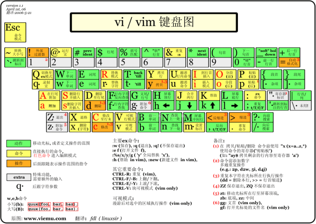

> 原文转载自微信公众号「walker-行者」Linux 系列。
> 原始链接：https://mp.weixin.qq.com/s?__biz=MzkwMDgyMTA2OQ==&mid=2247483815&idx=1&sn=57add2922e12a29ae92986530d0b37a0&chksm=c0bf7885f7c8f1937a09e6cfa36cd5f3a12112244184b675ddd91e99f60113cd53ce54e17aa0&cur_album_id=4586547322464501762&scene=189#wechat_redirect

## Linux文本编辑器指南：Vim、Nano与主流编辑器盘点

## 零、为什么需要学会命令行文本编辑器？

在Linux服务器上，很多场景下没有图形界面可用：

-   修改系统配置文件（如 `/etc/nginx/nginx.conf`）
    
-   编写Shell脚本
    
-   提交Git commit message
    
-   快速编辑远程服务器上的代码
    

这时候，命令行文本编辑器就是你的**救命稻草**。下面介绍最主流的几款。

#   

## 二、Nano 命令笔记

Nano 是一个轻量级、对新手友好的终端编辑器，所有快捷键都在屏幕底部显示（`^` 表示 `Ctrl`）。

### 2.1 启动

| 
命令

 | 

说明

 |
| --- | --- |
| `nano 文件名` | 

打开或新建文件

 |
| `nano -l 文件名` | 

显示行号

 |
| `nano -m 文件名` | 

启用鼠标支持

 |
| `nano -B 文件名` | 

保存前自动备份原文件

 |
| `nano -c 文件名` | 

显示光标位置信息

 |

### 2.2 核心快捷键（Ctrl 系列，`^` = `Ctrl`）

| 
快捷键

 | 

说明

 |
| --- | --- |
| `Ctrl + O` | 

保存文件（Write Out）

 |
| `Ctrl + X` | 

退出（Exit）

 |
| `Ctrl + G` | 

查看帮助（Get Help）

 |
| `Ctrl + K` | 

剪切整行（Cut，相当于 vim 的 dd）

 |
| `Ctrl + U` | 

粘贴（Uncut，粘贴刚才剪切的行）

 |
| `Ctrl + W` | 

搜索（Where Is）

 |
| `Ctrl + \` | 

搜索并替换

 |
| `Ctrl + C` | 

显示当前光标位置（行号、列号）

 |
| `Ctrl + J` | 

段落对齐（Justify）

 |
| `Ctrl + T` | 

调用拼写检查

 |
| `Ctrl + R` | 

读取另一个文件插入当前位置

 |
| `Ctrl + _` | 

跳转到指定行号

 |

### 2.3 Alt 系列快捷键（`M-` = `Alt`）

| 
快捷键

 | 

说明

 |
| --- | --- |
| `Alt + 6` | 

复制当前行（不剪切）

 |
| `Alt + A` | 

开始标记选择（类似 vim 可视模式）

 |
| `Alt + #` | 

注释/取消注释当前行

 |
| `Alt + U` | 

撤销（Undo）

 |
| `Alt + E` | 

重做（Redo）

 |
| `Alt + G` | 

跳转到指定行

 |

### 2.4 Nano 操作流程速记

```
打开文件 → nano test.txt编辑内容 → 直接输入即可（无模式概念）保存     → Ctrl + O → 回车确认文件名退出     → Ctrl + X
```

* * *

## 三、其他高使用率编辑器

### 3.1 终端编辑器对比

| 
编辑器

 | 

特点

 | 

适用场景

 |
| --- | --- | --- |
| **vim / vi** | 

模式编辑，功能强大，几乎所有 Linux 预装

 | 

服务器运维、远程编辑、高效文本处理

 |
| **nano** | 

简单直观，无模式，底部提示快捷键

 | 

快速修改配置文件、新手入门

 |
| **emacs** | 

功能极其丰富（"伪装成编辑器的操作系统"），可收发邮件、浏览网页

 | 

重度 Lisp 用户、一站式工作流

 |
| **micro** | 

现代终端编辑器，支持鼠标、多光标、语法高亮，开箱即用

 | 

想要现代体验但不想学 vim 的用户

 |

### 3.2 图形界面编辑器

| 
编辑器

 | 

特点

 | 

适用场景

 |
| --- | --- | --- |
| **gedit** | 

GNOME 桌面默认编辑器，轻量简洁

 | 

Ubuntu 桌面日常编辑

 |
| **VS Code** | 

微软出品，插件生态丰富，远程开发能力强

 | 

前后端开发、远程 SSH 开发

 |
| **Sublime Text** | 

极速启动，界面优雅，多光标编辑

 | 

快速查看和编辑大文件

 |

  

##   

## 一、Vim 命令笔记

### 1.1 Vim 的三种核心模式

Vim 是 Vi Improved 的缩写，是 Linux 下最强大的文本编辑器之一。它的核心设计理念是**模式化编辑**。

Vim 核心分为**普通模式**、**插入模式**、**命令行模式**，三者可以互相切换，是使用 Vim 的基础。

### 1\. 普通模式（Normal 模式）

**进入方式**

-   打开文件默认就是普通模式
    
-   在其他模式按 `Esc` 退回此模式
    

**作用**

不能输入文字，专门用来光标移动、复制、删除、粘贴、撤销、跳转等文本操作。

**常用操作举例**

| 
按键

 | 

功能

 |
| --- | --- |
| `h`

 / `j` / `k` / `l`

 | 

左 / 下 / 上 / 右移动光标

 |
| `dd` | 

删除一整行

 |
| `yy` | 

复制一整行

 |
| `p` | 

粘贴

 |
| `u` | 

撤销修改

 |
| 

 /

 | 

查询，使用n查询下一个

 |
| 

gg/ G

 | 

gg 首行，3gg 第三行，大写G尾行

 |

### 备注：删除5行：5yy

* * *

###   

### 2\. 插入模式（Insert 模式、编辑模式）

**进入方式**（普通模式下按以下按键）

| 
按键

 | 

功能

 |
| --- | --- |
| `i` | 

光标前面插入文字（最常用）

 |
| `a` | 

光标后面插入文字

 |
| `o` | 

光标下方新开一行插入

 |
| `O` | 

光标上方新开一行插入

 |

**作用**

唯一可以输入、编辑文字的模式，屏幕底部会显示 `-- INSERT --` 标识。

**退出**

按下 `Esc` 回到普通模式。

* * *

### 3\. 命令行模式（Command-line 模式）

**进入方式**

普通模式下按英文冒号 `:`，底部出现 `:` 输入框。

**作用**

执行保存、退出、查找替换、设置参数、批量操作、调用工具等底层命令。

**高频常用命令**

| 
命令

 | 

功能

 |
| --- | --- |
| `:w` | 

保存文件

 |
| `:q` | 

退出文件

 |
| `:wq` | 

保存并退出

 |
| `:q!` | 

强制退出，放弃修改

 |
| `:set nu` | 

显示行号  / nonu取消显示

 |
| `:%s/旧文本/新文本/g` | 

全文替换

 |

* * *

### 模式切换简易流程图

```
普通模式  │  ├── i / a / o ──→ 插入模式 ──→ Esc ──→ 普通模式  │  └── : ──→ 命令行模式 ──→ 回车执行 / Esc 取消 ──→ 普通模式
```

> 要点：插入模式和命令行模式之间**不能直接切换**，必须先按 `Esc` 回到普通模式，再进入另一模式。普通模式是所有切换的枢纽。

  

如上图所示，Vim 的三种模式是理解所有命令的基础。下面是完整的命令笔记。



图片来自：

https://blog.csdn.net/zhlh\_xt/article/details/52458672

  

* * *

## 二++、Vim 命令详细笔记（可以跳过）

### 1.1 启动与打开文件

| 
命令

 | 

说明

 |
| --- | --- |
| `vim 文件名` | 

打开或新建文件

 |
| `vim +n 文件名` | 

打开文件并定位到第 n 行

 |
| `vim + 文件名` | 

打开文件并定位到最后一行

 |
| `vim +/关键词 文件名` | 

打开文件并定位到第一个匹配关键词处

 |
| `vim -R 文件名` | 

只读模式打开

 |
| `view 文件名` | 

只读模式打开（等同于 `vim -R`）

 |

### 1.2 正常模式（Normal Mode）— 移动

| 
命令

 | 

说明

 |
| --- | --- |
| `h` | 

左移一个字符

 |
| `j` | 

下移一行

 |
| `k` | 

上移一行

 |
| `l` | 

右移一个字符

 |
| `w` | 

跳到下一个单词开头

 |
| `b` | 

跳到上一个单词开头

 |
| `e` | 

跳到当前/下一个单词末尾

 |
| `0` | 

跳到行首

 |
| `^` | 

跳到行首第一个非空字符

 |
| `$` | 

跳到行尾

 |
| `gg` | 

跳到文件第一行

 |
| `G` | 

跳到文件最后一行

 |
| `nG`

 或 `:n`

 | 

跳到第 n 行

 |
| `Ctrl + f` | 

向下翻一页（Page Down）

 |
| `Ctrl + b` | 

向上翻一页（Page Up）

 |
| `Ctrl + d` | 

向下翻半页

 |
| `Ctrl + u` | 

向上翻半页

 |
| `{` | 

跳到上一个段落

 |
| `}` | 

跳到下一个段落

 |

### 1.3 正常模式 — 编辑操作

| 
命令

 | 

说明

 |
| --- | --- |
| `x` | 

删除光标处字符（向后删）

 |
| `X` | 

删除光标前字符（向前删）

 |
| `dd` | 

删除（剪切）整行

 |
| `ndd` | 

删除当前行起的 n 行（如 `3dd`）

 |
| `dw` | 

删除一个单词

 |
| `d$`

 或 `D`

 | 

删除从光标到行尾

 |
| `d0` | 

删除从行首到光标

 |
| `dG` | 

删除从当前行到文件末尾

 |
| `dgg` | 

删除从文件开头到当前行

 |
| `yy` | 

复制（yank）整行

 |
| `nyy` | 

复制 n 行（如 `3yy`）

 |
| `yw` | 

复制一个单词

 |
| `y$` | 

复制从光标到行尾

 |
| `p` | 

粘贴到光标后/下方

 |
| `P` | 

粘贴到光标前/上方

 |
| `r` | 

替换光标处单个字符（按 r 后输入新字符）

 |
| `R` | 

进入替换模式，连续替换

 |
| `u` | 

撤销（undo）

 |
| `Ctrl + r` | 

重做（redo）

 |
| `.` | 

重复上一次操作

 |
| `~` | 

切换光标处字符大小写

 |
| `>>` | 

当前行右移（缩进）

 |
| `<<` | 

当前行左移（取消缩进）

 |

### 1.4 进入插入模式（Insert Mode）

| 
命令

 | 

说明

 |
| --- | --- |
| `i` | 

在光标前插入

 |
| `I` | 

在行首第一个非空字符前插入

 |
| `a` | 

在光标后插入（append）

 |
| `A` | 

在行尾插入

 |
| `o` | 

在下方新开一行并进入插入

 |
| `O` | 

在上方新开一行并进入插入

 |
| `s` | 

删除光标字符并进入插入

 |
| `S` | 

删除整行并进入插入

 |
| `cw` | 

删除当前单词并进入插入

 |
| `Esc` | 

退出插入模式，回到正常模式

 |

### 1.5 命令行模式（Command Mode）

在正常模式下输入 `:` 进入命令行模式。

**文件操作：**

| 
命令

 | 

说明

 |
| --- | --- |
| `:w` | 

保存

 |
| `:w 文件名` | 

另存为

 |
| `:q` | 

退出（未修改时）

 |
| `:q!` | 

强制退出不保存

 |
| `:wq` | 

保存并退出

 |
| `:x` | 

保存并退出（仅当有修改时才写入）

 |
| `ZZ` | 

保存并退出（正常模式下直接按）

 |
| `:wq!` | 

强制保存并退出

 |

**搜索与替换：**

| 
命令

 | 

说明

 |
| --- | --- |
| `/关键词` | 

向下搜索关键词

 |
| `?关键词` | 

向上搜索关键词

 |
| `n` | 

跳到下一个匹配

 |
| `N` | 

跳到上一个匹配

 |
| `:s/旧/新/` | 

替换当前行第一个匹配

 |
| `:s/旧/新/g` | 

替换当前行所有匹配

 |
| `:%s/旧/新/g` | 

全文替换所有匹配

 |
| `:%s/旧/新/gc` | 

全文替换，逐个确认

 |
| `:n,ms/旧/新/g` | 

替换第 n 行到第 m 行

 |

**其他常用：**

| 
命令

 | 

说明

 |
| --- | --- |
| `:set nu` | 

显示行号

 |
| `:set nonu` | 

取消行号

 |
| `:set ai` | 

自动缩进

 |
| `:set ts=4` | 

设置 Tab 宽度为 4

 |
| `:set hlsearch` | 

高亮搜索结果

 |
| `:set paste` | 

粘贴模式（防止自动缩进干扰）

 |
| `:set nopaste` | 

关闭粘贴模式

 |
| `:!命令` | 

执行外部 Shell 命令（如 `:!ls`）

 |
| `:r 文件名` | 

将另一文件内容读入当前文件

 |
| `:r !命令` | 

将命令输出读入文件（如 `:r !date`）

 |
| `:sp 文件名` | 

水平分屏打开文件

 |
| `:vsp 文件名` | 

垂直分屏打开文件

 |
| `Ctrl + w w` | 

在分屏窗口间切换

 |

### 1.6 可视模式（Visual Mode）

| 
命令

 | 

说明

 |
| --- | --- |
| `v` | 

字符可视模式（按字符选择）

 |
| `V` | 

行可视模式（按行选择）

 |
| `Ctrl + v` | 

块可视模式（列选择，批量注释利器）

 |
| 

选中后 `y`

 | 

复制选中文本

 |
| 

选中后 `d`

 | 

删除选中文本

 |
| 

选中后 `>`

 | 

右移选中区域

 |

* * *

##
